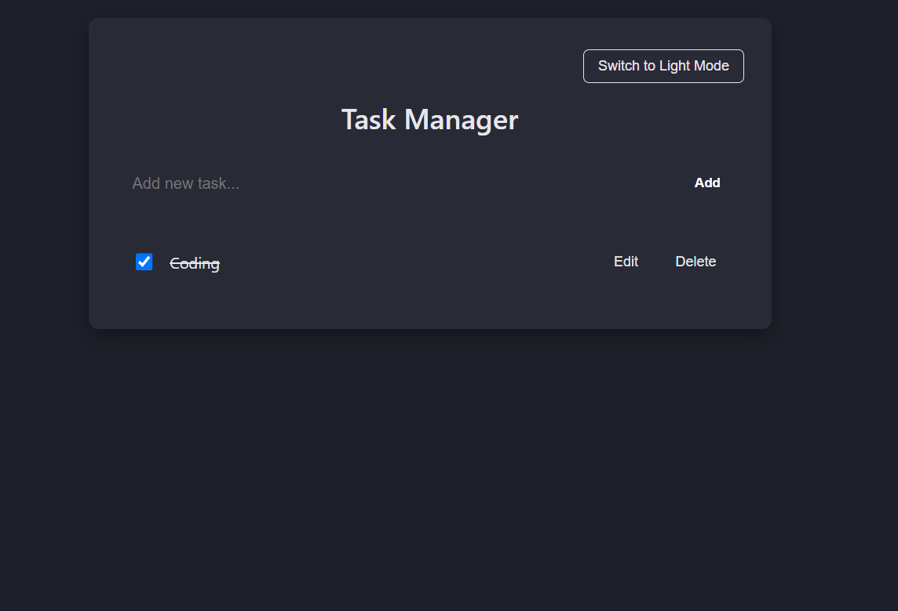
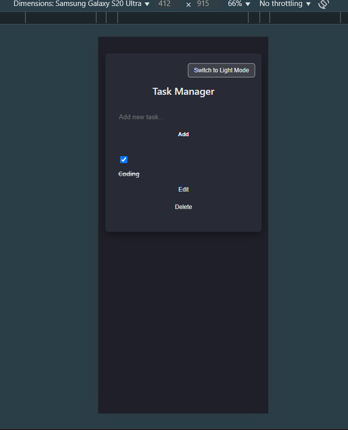

# 📝 Task Manager (Capstone Project - React)

This is a professional task manager built in **ReactJS** as part of the Module 2 Capstone Project. It includes all required features like task creation, editing, deletion, marking complete, local storage persistence, responsive dark UI, modular structure, and test coverage using Jest.

---

## 🚀 Features

- ✅ Add, edit, delete tasks
- ✅ Mark tasks as completed/uncompleted
- ✅ Save/load tasks from local storage
- ✅ Responsive dark-themed user interface
- ✅ Clean code organized with ES6 modules
- ✅ Tests written with Jest and React Testing Library
- ✅ Linted with ESLint 

---

## 🌓 Theme Toggle

Click the toggle button to switch between:
- 🌙 Dark Mode (default)
- ☀️ Light Mode (auto-updates app styling)

The theme updates live without reloading the page.

---

## 🛠️ Tech Stack

- React (Create React App)
- JavaScript (ES6+)
- CSS (custom dark theme)
- Jest & React Testing Library
- ESLint (Airbnb config)
- Local Storage API

---

## 📁 Folder Structure
src/
├── components/ # TaskForm, TaskItem, TaskList
├── services/ # storage.js for local storage
├── styles/ # Individual CSS files per component
├── tests/ # Jest unit tests
├── App.js # Main component
├── index.js # Entry point


---

## 📦 Installation & Running Locally

1. Clone this repository:

```bash
git clone https://github.com/your-username/task-manager.git
cd task-manager

npm install

npm start

---

## 🧪 Testing

Unit tests cover:
- Adding a task
- Editing a task
- Completing a task
- Deleting a task
- Local storage load/save


npm test


 ## 🧹 Linting
ESLint ensures consistent, clean code.


Copy
Edit
npx eslint src/

## 📸 Screenshots




Built with ❤️ using React


